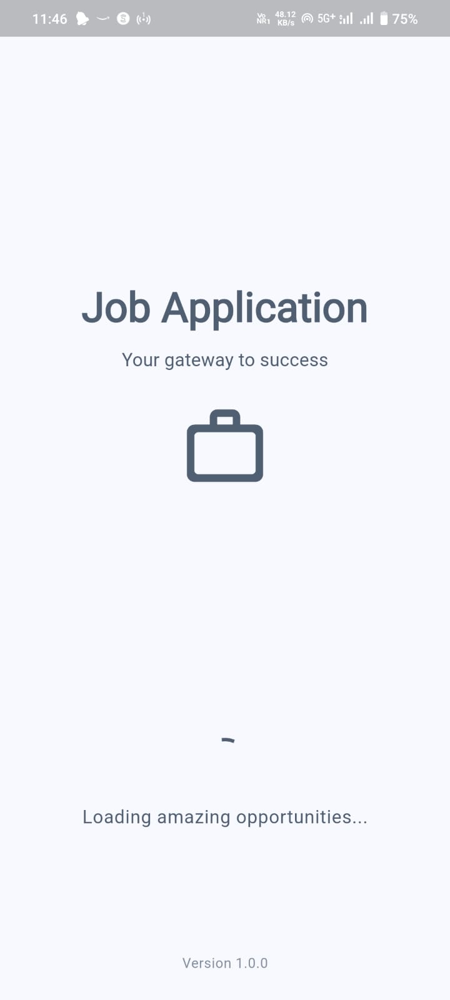
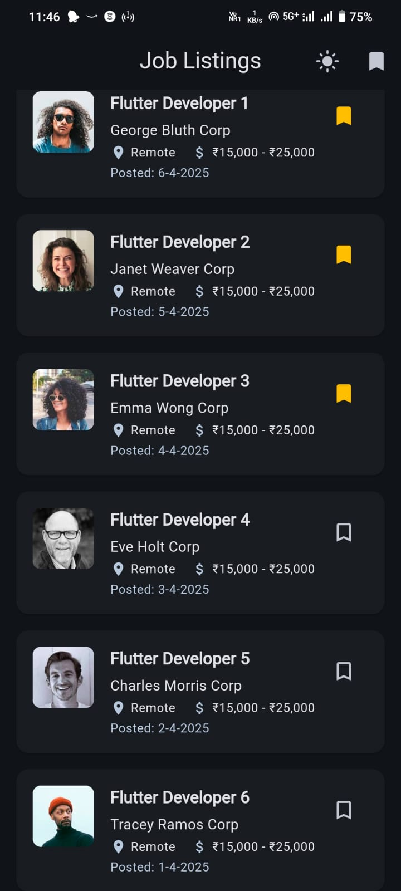

# 🚀 Flutter Job Listing App

<div align="center">
  
  
  <p>A sleek, modern job board application built with Flutter.</p>

  [](https://github.com/DEVILGHAZI/job_applocation)
  [](https://flutter.dev)
  [](LICENSE)
</div>

## ✨ Overview

This professionally designed Job Board App was created as part of a job application assignment. Browse listings, view detailed job information, and bookmark favorite opportunities - all with a beautiful, responsive UI that supports both light and dark themes.

## 📱 Features

<div align="center">
  <table>
    <tr>
      <td align="center">📡 REST API</td>
      <td align="center">📦 Freezed Models</td>
      <td align="center">🧠 BLoC Pattern</td>
    </tr>
    <tr>
      <td align="center">💾 Job Bookmarks</td>
      <td align="center">🎨 Theme Switcher</td>
      <td align="center">✅ Clean Architecture</td>
    </tr>
  </table>
</div>

- **Data Fetching**: Integrated with Dio for efficient API communication
- **State Management**: BLoC (Cubit) pattern for predictable state handling
- **Persistence**: Save your favorite jobs for later viewing
- **Theming**: Beautiful light & dark theme implementation
- **Architecture**: Modular folder structure following clean architecture principles
- **Responsive**: Adaptive design that works across device sizes

## 📸 Screenshots

<div align="center">
  <table>
    <tr>
      <td></td>
      <td></td>
      <td></td>
    </tr>
    <tr>
      <td><p align="center">Job Listings</p></td>
      <td><p align="center">Job Details</p></td>
      <td><p align="center">Saved Jobs</p></td>
    </tr>
    <tr>
      <td></td>
      <td></td>
      <td></td>
    </tr>
    <tr>
      <td><p align="center">Splash Screen</p></td>
      <td><p align="center">Dark Theme</p></td>
      <td></td>
    </tr>
  </table>
</div>

## 📦 Try It Out

<div align="center">
  <a href="https://drive.google.com/file/d/1qF5CUzhLQmzy1ds3A580TYaeh-hz6neo/view?usp=sharing">
    
  </a>
</div>

> ⚠️ Note: You may need to enable "Install from Unknown Sources" in your device settings.

## 🧱 Project Architecture

```
lib/
├── core/
│   └── di/
│       └── injection_container.dart
├── data/
│   ├── models/
│   │   └── job_model.dart
│   └── repositories/
│       ├── job_repository_impl.dart
│       └── saved_jobs_repository_impl.dart
├── domain/
│   └── repositories/
│       ├── job_repository.dart
│       └── saved_jobs_repository.dart
├── presentation/
│   ├── blocs/
│   │   ├── jobs/
│   │   │   └── jobs_cubit.dart
│   │   ├── saved_jobs/
│   │   │   └── saved_jobs_cubit.dart
│   │   └── theme/
│   │       └── theme_cubit.dart
│   ├── config/
│   │   └── theme.dart
│   ├── screens/
│   │   ├── job_detail_screen.dart
│   │   ├── job_listing_screen.dart
│   │   ├── saved_jobs_screen.dart
│   │   └── splash_screen.dart
│   └── widgets/
│       └── job_card.dart
└── main.dart
```

## 🛠️ Technology Stack

<div align="center">
  <table>
    <tr>
      <td align="center"></td>
      <td align="center"></td>
    </tr>
    <tr>
      <td align="center">Flutter</td>
      <td align="center">Dio</td>
    </tr>
    <tr>
      <td align="center"></td>
      <td align="center"></td>
    </tr>
    <tr>
      <td align="center">BLoC (Cubit)</td>
      <td align="center">MockAPI</td>
    </tr>
  </table>
</div>

## 🚀 Getting Started

1. **Clone the repository**
   ```bash
   git clone https://github.com/DEVILGHAZI/job_applocation.git
   cd job_applocation
   ```

2. **Install dependencies**
   ```bash
   flutter pub get
   ```

3. **Run the app**
   ```bash
   flutter run
   ```

## 👨‍💻 Developer

<div align="center">
  
  <h3>Mohd Washid</h3>
  
  [](mailto:mwashid914@gmail.com)
  [](tel:+918958618665)
  [](https://mohdwashid.github.io/my-resume-app/)
</div>

## 📋 Assignment Information

This project was developed as part of the hiring process for a Flutter Developer position, demonstrating proficiency in modern Flutter development practices.

---

<div align="center">
  <p>✨ Made with Flutter and ❤️</p>
</div>